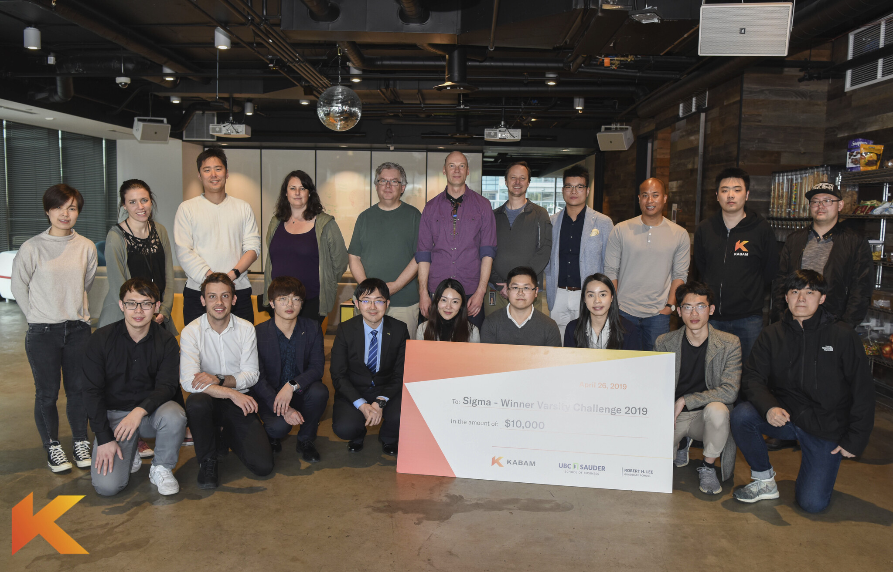

Recently, I had the opportunity to participate in the Kabam Games Varsity Challenge hosted by UBC Sauder School of Business as a graduate student of the UBC Masters of Data Science (MDS) program. It was an incredible journey that spanned over almost two months, with 49 registered teams competing to create a model that predicts player behaviour for Kabam’s suite of mobile games. After two rounds of evaluations, our team, Sigma (Bailey Lei, June Wu, Betty Zhou) was selected as the winner of this challenge and received the grand prize of $10,000.

The Kabam Varsity Challenge was a unique challenge as it was more focused on real-world applications of Data Science. It was not solely a coding competition, but one that motivated participants to reflect on business problems that required quantitative thinking, business acumen and communication skills. The first round consisted of an objective component based on the quality of our predictive model, as well as a subjective component that involved designing a metric system for player quality. In the second round, Kabam selected a diverse panel that consisted of a data science specialist, an engineering generalist and an industry generalist, to evaluate the ability of participating teams to present and explain complex ideas in simple terms.

While I won’t be sharing the nitty-gritty details of the competition, I do have some key advice to share on how to succeed in such competitions.

##### Teamwork:

A well-balanced team is vital to success, and the importance of having members with different strengths and backgrounds were highlighted in competition. The diversity in our team allowed us to approach the challenge in a multitude of perspectives. Seeing the problem from different perspectives and getting constructive feedback among the group members definitely helped us reduce the effect of groupthink. While each team member was assigned to a specific task, all members participated equally in all aspects of the project, which was a key contributor to the success of our team.

##### Exploratory data analysis (EDA):

We spent a large portion of our time performing EDA throughout the competition. The use of effective visualizations was crucial since not all members had a data science background. This also worked in our favour since the challenge had a huge emphasis on communication. Therefore, good visualizations provided a big step forward in telling the story and generating good hypotheses. The EDA paid off when we moved on to implementing our ML algorithm since the goal wasn’t to simply produce the best predictive model, but one that was meaningful and interpretable.

##### Know your Audience
I learned the concept “curse of knowledge” in my MDS program during our communication course. Essentially, it means what might be self-explanatory to you may not be easily comprehensible to your audience. We recognized that this might be a problem from the very beginning and understood that having the best algorithm would not do any good if no one else understood it. One thing that our team found especially effective was to remove content that was confusing, even if it meant deleting hours of work. One should always focus on the big picture and think about how to communicate effectively to the target audience.

##### Test your Code

Implementing unit test within our scripts was one of the most important things that our team learned from this competition. It allowed for early detection and correction of our code, which ultimately allowed our team to save time on debugging and maintain high-quality code. Since most python scripts for machine learning model are fairly short, it can be tempting to ignore unit tests.

Overall, analyzing real data turned out to be a very enjoyable process. It was definitely more challenging than working with toy datasets, but at the same time, I also learned many new tools and methods along the way. Many concepts (such as cross-validation, feature preprocessing and hyperparameter tuning) taught by professors Mike Gelbart and Rodolfo Lourenzutti in the MDS program were also essential to our success. They made the model selection process in this competition much simpler.

Lastly, UBC Sauder and Kabam did an excellent job of organizing and hosting this event. Being a competitive gamer, it was very fascinating to learn about Kabam’s history and business model.
